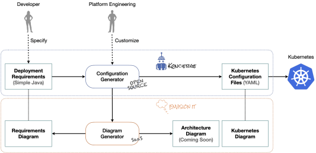

# Koncierge

### _Give Koncierge your deployment requirements and it will help you get your application deployed to Kubernetes._

## Overview



Koncierge enables developers to specify their high-level deployment requirements in simple Java code. 
Your platform engineers can then optionally customize the _configuration generator_ or leave it with the best practice default options. 
Koncierge then generates the YAML files that are needed to configure Kubernetes.

At the same time you can optionally use [EnvisionIt](https://envisionit.app/kubernetes) to generate diagrams for you. 
This service is free for public models (if you don't mind anyone seeing your diagrams) or you can become a customer of EnvisionIt to keep them private.

These diagrams enable the developers to confirm that they have expressed their requirements correctly. 
They also enable the platform engineers to confirm the architecture of the deployment that is generated and 
inspect the detailed Kubernetes configuration in a visual way that makes it easier to understand it and has links to the documentation. 

## How it works

### Step 1: Express your high-level deployment requirements in Java code

For example:
```java
DeploymentRequirements deploymentRequirements = new DeploymentRequirements();

Application application = new Application(deploymentRequirements);
application.setShortName("To Do");
application.setLongName("To Do Application");

ApplicationEnvironment localApplicationEnvironment = new ApplicationEnvironment(application, Environment.LOCAL, "todo.test");
ApplicationEnvironment devApplicationEnvironment = new ApplicationEnvironment(application, Environment.DEV, "todo.dev.internal.example.com");
ApplicationEnvironment intApplicationEnvironment = new ApplicationEnvironment(application, Environment.INT, "todo.int.internal.example.com");
ApplicationEnvironment perfApplicationEnvironment = new ApplicationEnvironment(application, Environment.PERF, "todo.perf.internal.example.com");
ApplicationEnvironment prodApplicationEnvironment = new ApplicationEnvironment(application, Environment.PROD, "example.com");
devApplicationEnvironment.addSubsequentApplicationEnvironment(intApplicationEnvironment);
intApplicationEnvironment.addSubsequentApplicationEnvironment(perfApplicationEnvironment);
intApplicationEnvironment.addSubsequentApplicationEnvironment(prodApplicationEnvironment);
perfApplicationEnvironment.addSubsequentApplicationEnvironment(prodApplicationEnvironment);

Component backendComponent = new Component(application);
backendComponent.setName("Backend");
backendComponent.setImage("kubernetesdemo/to-do-app-backend");
Port backendPort = new Port(backendComponent, 8080);

Variable dbUsernameVariable = new Variable(backendComponent, "DB_USERNAME");

Variable dbPasswordVariable = new Variable(backendComponent, "DB_PASSWORD");

Variable dbHostVariable = new Variable(backendComponent, "DB_HOST");

Variable dbNameVariable = new Variable(backendComponent, "DB_NAME");

Component frontendComponent = new Component(application);
frontendComponent.setName("Frontend");
frontendComponent.setImage("kubernetesdemo/to-do-app-frontend");
Port frontendPort = new Port(frontendComponent, 8080);

Variable serverUriVariable = new Variable(frontendComponent, "SERVER_URI");

Database database = new Database(application);
database.setName("Database");
database.setDatabaseType("mysql");
Port databasePort = new Port(database, 3306);

Storage storage = new Storage(application, Storage.Size.Gibibytes, 1);
new StorageUsage(database, storage, StorageUsage.Mode.ReadWrite, "/var/lib/mysql");

Variable mysqlRootPasswordVariable = new Variable(database, "MYSQL_ROOT_PASSWORD");

Variable mysqlUserVariable = new Variable(database, "MYSQL_USER");

Variable mysqlPasswordVariable = new Variable(database, "MYSQL_PASSWORD");

Variable mysqlDatabaseVariable = new Variable(database, "MYSQL_DATABASE");

Value dbUsernameValue = new ProvidedBase64EncodedPassword(application, "dXNlcg==");
dbUsernameValue.assignTo(dbUsernameVariable);
dbUsernameValue.assignTo(mysqlUserVariable);

Value dbPasswordValue = new ProvidedBase64EncodedPassword(application, "ZGV2ZWxvcA==");
dbPasswordValue.assignTo(dbPasswordVariable);
dbPasswordValue.assignTo(mysqlPasswordVariable);

Value mysqlRootPasswordValue = new ProvidedBase64EncodedPassword(application, "bWFnaWM=");
mysqlRootPasswordValue.assignTo(mysqlRootPasswordVariable);

Value databaseHostNameValue = database.getHostName();
databaseHostNameValue.assignTo(dbHostVariable);

Value databaseName = new ConstantValue(application, "todo");
databaseName.assignTo(mysqlDatabaseVariable);
databaseName.assignTo(dbNameVariable);

new DefaultRoute(application, frontendPort);
Route backendRoute = new SubDomainRoute(application, backendPort, "api");
backendRoute.getDomainName().assignTo(serverUriVariable);
```

See the full class here: [ToDoExample.java](examples%2Fexample2%2Fsrc%2Fmain%2Fjava%2Ftech%2Fkoncierge%2Fexamples%2Fexample2%2FToDoExample.java)

### Step 2: Run the configuration generator
```java
public static void main(String[] args) {
    DeploymentRequirements deploymentRequirements = createDeploymentRequirements();

    String workingDirectory = WorkingDirectoryUtil.getWorkingDirectory(ToDoExample.class);
    Config config = new Config(workingDirectory);

    DiagramGenerator.generateDeploymentRequirementsDiagrams(config, deploymentRequirements);

    KubernetesConfiguration kubernetesConfiguration = new ConfigurationGenerator(config, deploymentRequirements).generate();

    DiagramGenerator.generateKubernetesConfigurationDiagrams(config, kubernetesConfiguration);
}
```

It produces the YAML files you need for Kubernetes.

For example:
```yaml
apiVersion: v1
kind: ConfigMap
metadata:
  namespace: to-do
  name: backend
data:
  DB_HOST: database
  DB_NAME: todo
---
apiVersion: apps/v1
kind: Deployment
metadata:
  namespace: to-do
  name: backend
spec:
  replicas: 1
  selector:
    matchLabels:
      app: to-do
      component: backend
  template:
    metadata:
      labels:
        app: to-do
        component: backend
    spec:
      containers:
        - name: backend
          image: kubernetesdemo/to-do-app-backend
          env:
            - name: DB_USERNAME
              valueFrom:
                secretKeyRef:
                  name: backend
                  key: DB_USERNAME
            - name: DB_PASSWORD
              valueFrom:
                secretKeyRef:
                  name: backend
                  key: DB_PASSWORD
            - name: DB_HOST
              valueFrom:
                configMapKeyRef:
                  name: backend
                  key: DB_HOST
            - name: DB_NAME
              valueFrom:
                configMapKeyRef:
                  name: backend
                  key: DB_NAME
          ports:
            - containerPort: 8080
...
```

See the full output here: [ExpectedOutput-PROD.yaml](examples%2Fexample2%2Fsrc%2Ftest%2Fresources%2FExpectedOutput-PROD.yaml)

### Step 3: Confirm that the requirements have been specified correctly

This is what the generated _deployment requirements_ diagram looks like:


See it more clearly [here](https://envisionit.app/diagram/98675f0313504e8b96cc04aa141958ef/req).

### Step 4: Confirm that the generated Kubernetes configuration is correct

Your platform engineering team can do this and can customise the _configuration generator_ if they want it done differently. 

This is what the generated _Kubernetes configuration_ diagram looks like:

[](https://envisionit.app/diagram/98675f0313504e8b96cc04aa141958ef/k8s)

See the whole diagram with links to the documentation [here](https://envisionit.app/diagram/98675f0313504e8b96cc04aa141958ef/k8s).

### Step 5: Deploy to Kubernetes

See [How to deploy](docs%2Fdeploy.md).

## Next steps

### Next steps for developers

1. Study the [To Do List example](examples%2Fexample2%2FREADME.md) and try to deploy it yourself.
2. Deploy your own application.

### Next steps for platform engineers

1. Study the [ConfigurationGenerator.java](core%2Fsrc%2Fmain%2Fjava%2Ftech%2Fkoncierge%2Fgenerator%2FConfigurationGenerator.java).
2. See our [roadmap](docs%2Froadmap.md) for what is coming. 
2. [Contribute](CONTRIBUTING.md) if you think of improvements. 

